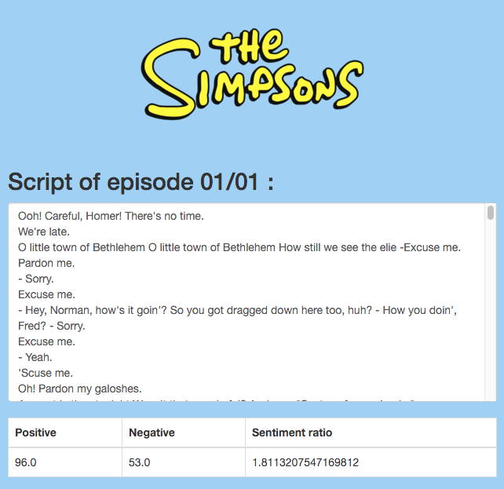
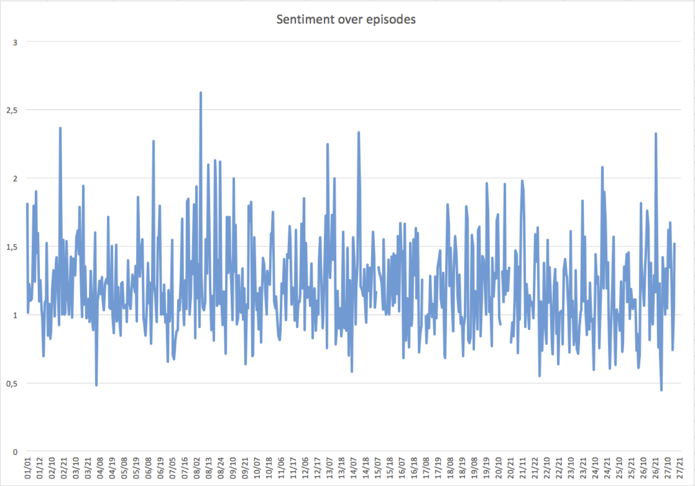

# MI-DDW homework #1
Sentiment analyzer of The Simpsons episodes

## How it works

- GET list of all The Simpsons episodes from [tvmaze.com](http://www.tvmaze.com) API
- GET script of selected episode from [springfieldspringfield.co.uk](http://www.springfieldspringfield.co.uk/)
- parse script into plaintext with [jsoup](http://jsoup.org/)
- make sentiment analyze of plaintext with [GATE Embedded](https://gate.ac.uk/family/embedded.html) (using JAPE grammar and [Bing Liu's Opinion Lexicon](https://www.cs.uic.edu/~liub/FBS/sentiment-analysis.html))

## Screenshots

